  # #EnDorphine

2018년 서울시 앱 공모전 출품작(I CAMP U)

기획 배경

1. 목적 
   - 시민들이 서울 도심 속에서 편리하게 캠핑장을 이용할 수 있도록 도와줌
2. 현재 캠핑장 상황
   - 서울 캠핑장 예약 진행 시 타 플랫폼으로 이동하여 진행
   - 예약 독점으로 인한 불법 거래 성행
   - 관리자와 이용객 간 소통의 불편
   - 캠핑장 이용자가 챙기지 못한 물품에 대한 대안의 필요성
3. 'I CAMP U' 의 필요성
   - 서울시 공공캠핑장들의 자세한 정보와 이벤트를 한눈에 볼 수 있고, 앱 자체에 예약기능이 있어 보다 손쉽게 캠핑을 접할 수 있음
   - 이용객들에게 본인 확인 QR코드를 자동 발급해줌으로써 관리자와 이용객 모두 편리해지고 신원확인의 소홀함으로 발생하는 범죄 노출 우려를 해결할 수 있음
   - 다양한 캠핑 후기를 바탕으로 캠핑장의 불편함을 다른 사용자들과 공유하고 관리자에게도 불편한 점을 알림으로써 쾌적한 캠핑 환경 조성함
   - 물물교환 기능으로 함께하는 캠핑 패러다임을 제시하고 성별, 나이에 상관없이 함께 즐길 수 있는 도시 캠핑 활성화를 촉진함
4. 기존 출시된 앱과의 차별성
   - 통합 예약 플랫폼을 제공
   - 한 사용자 당 캠핑장 예약 횟수를 제한하여 예약독점으로 인해 생기는 불법 거래 방지
   - 캠핑장 이용객들끼리 실시간 물물교환 채팅기능을 구현하여 이용객들 간의 소통의 장을 만듦
   - QR코드를 이용하여 캠피장 출입을 가능하게 만들어 관리자, 이용객 모두 편리하게 도와줌 

서비스 내용

- 로그인

  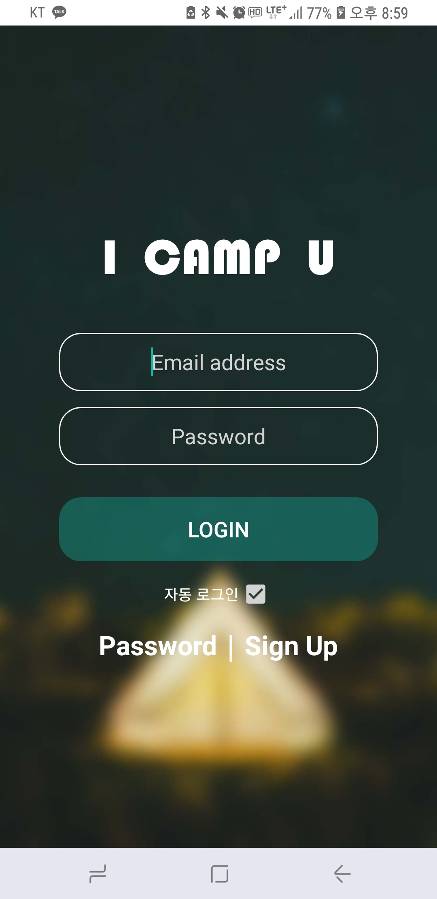
  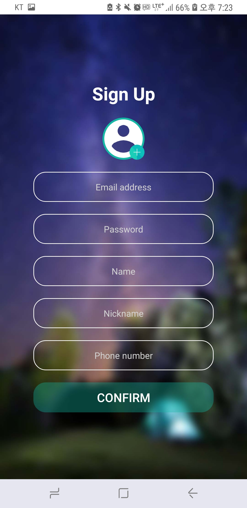
  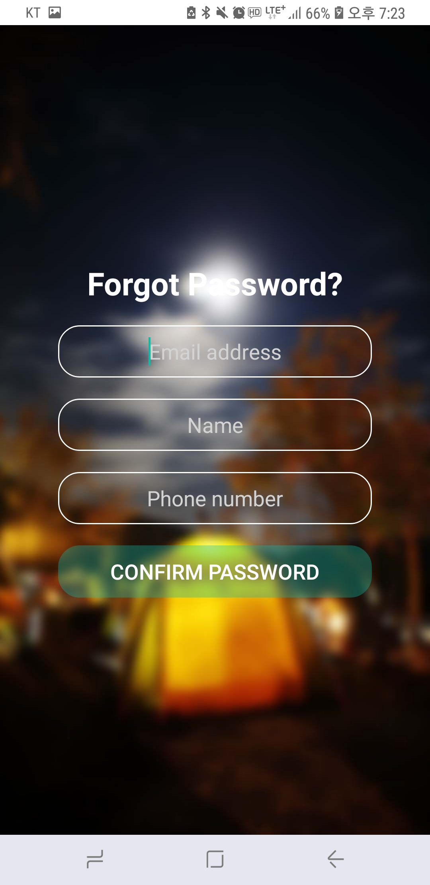

- 구성 

  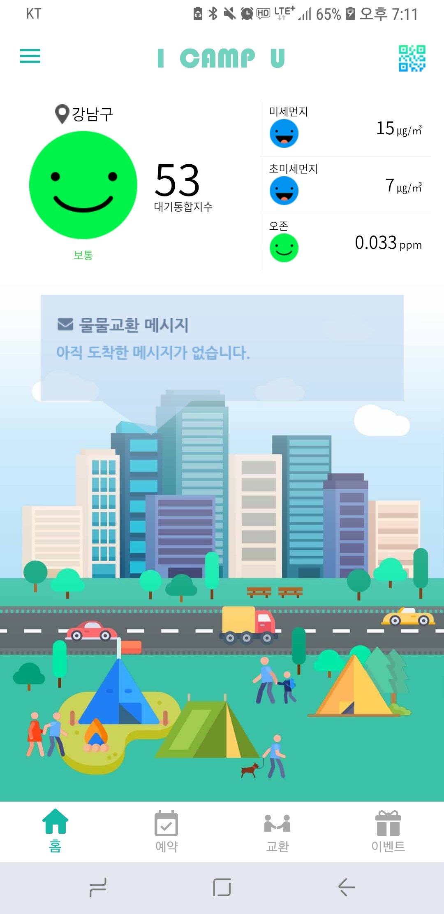
  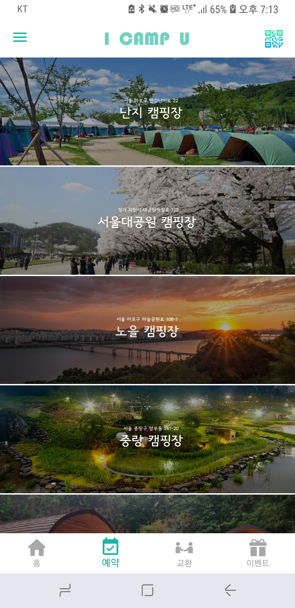
  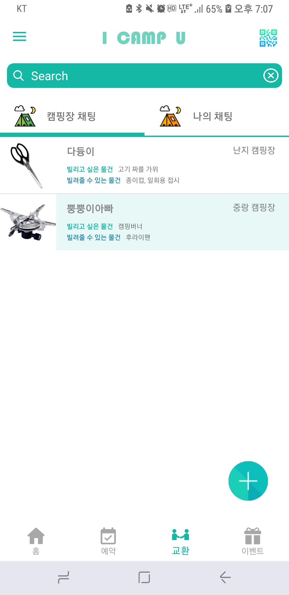
  

- 사이드바 

  
  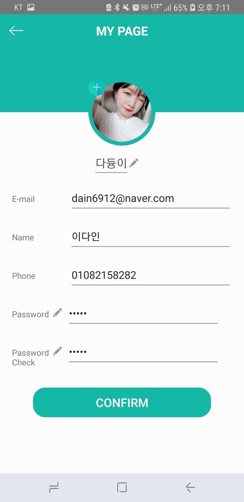
  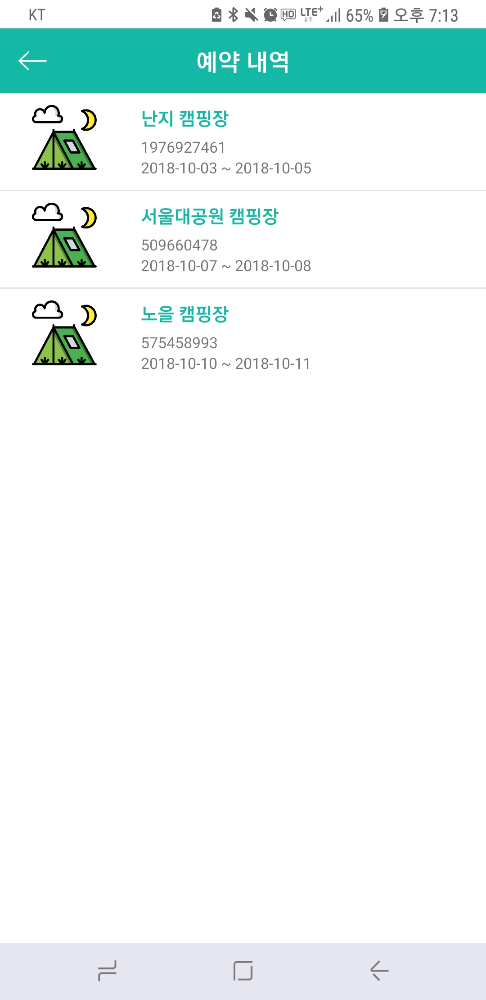
  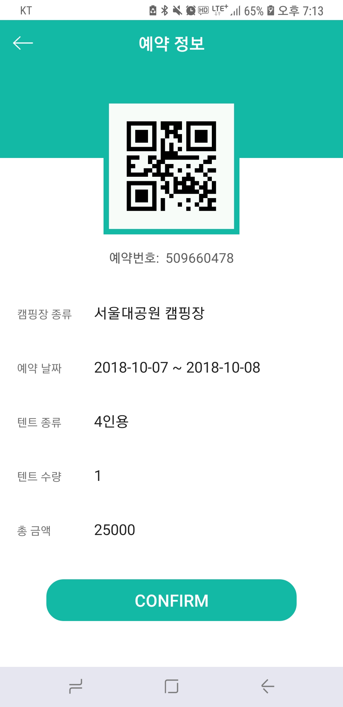

- 캠핑장 소개

  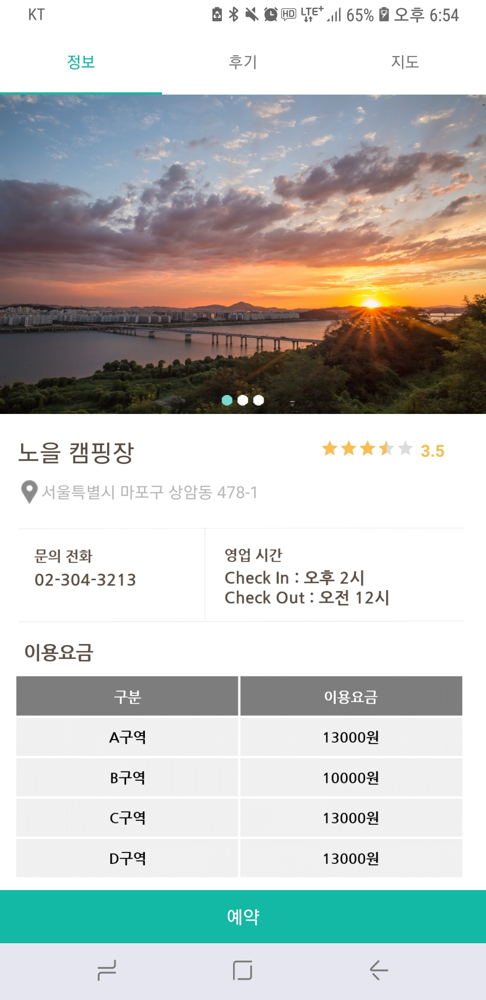
  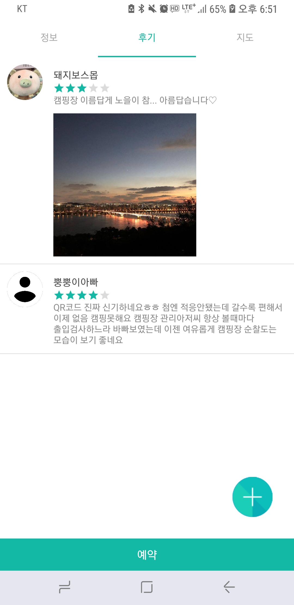
  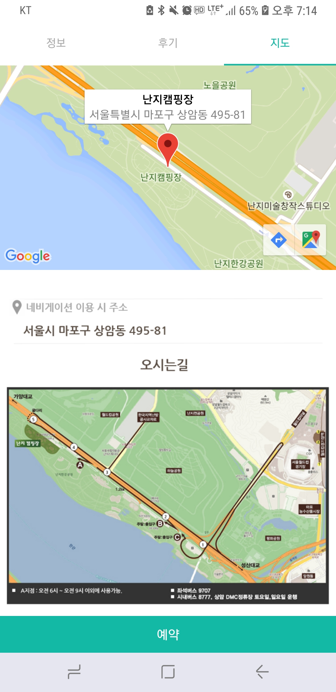

- 캠핑장 예약 

  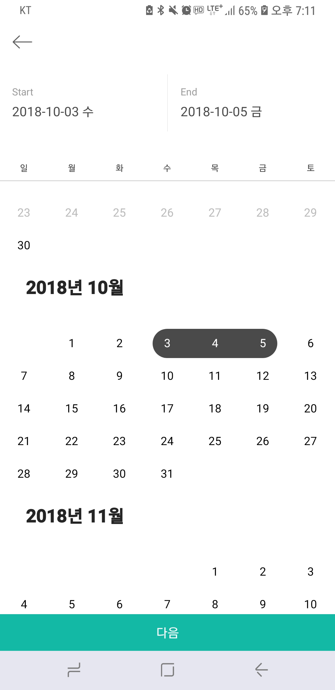
  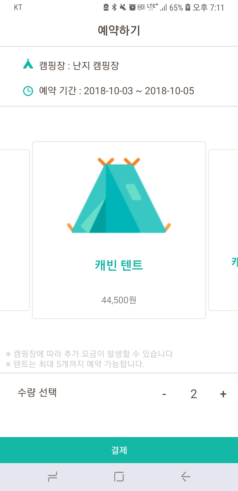
  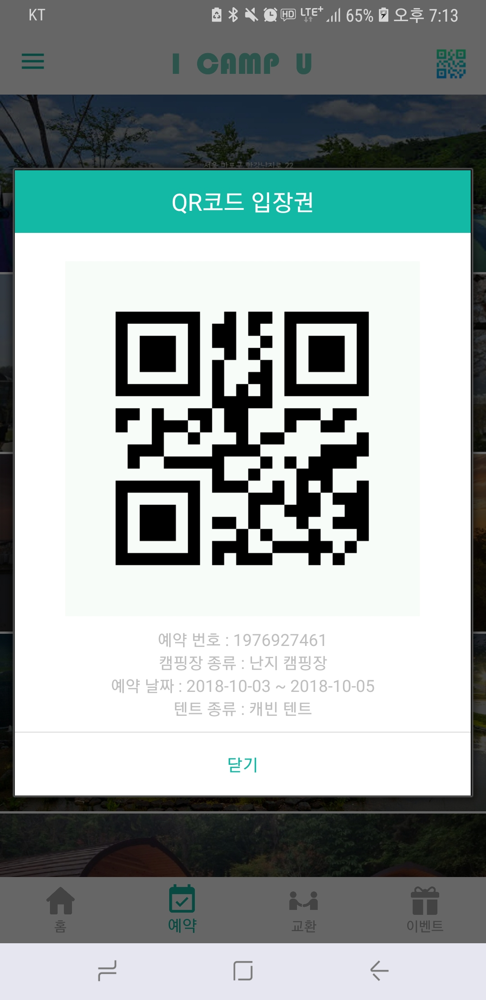

- 채팅방

  
  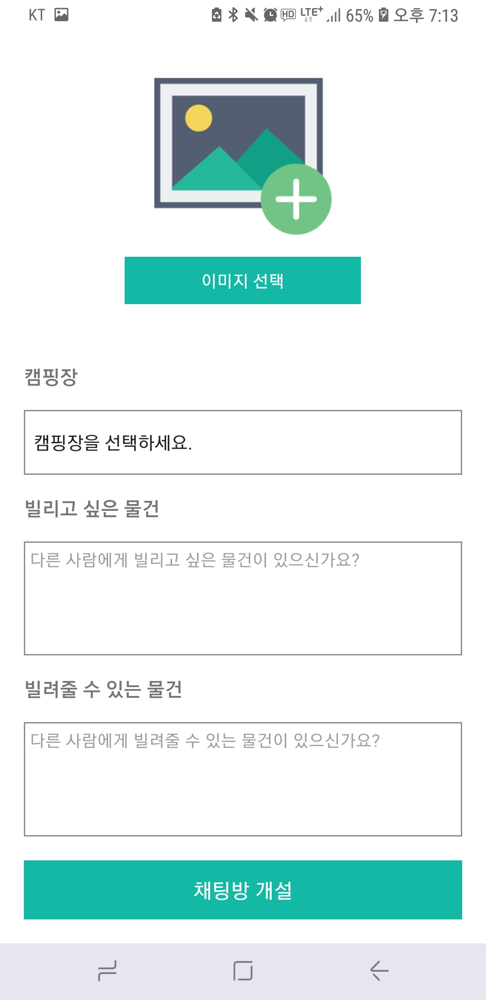

- 이벤트 상세정보

  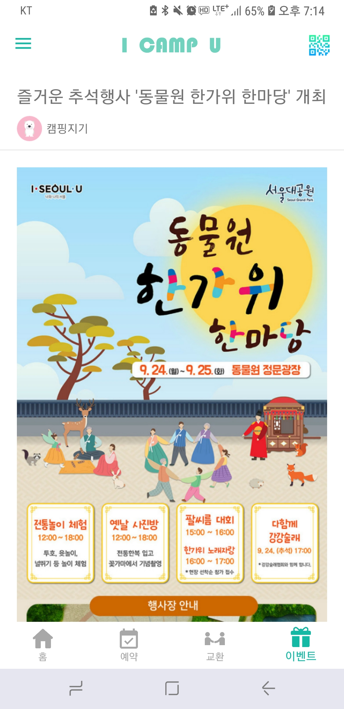

