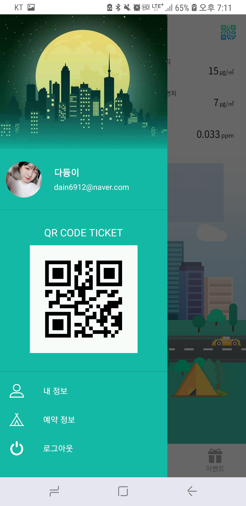
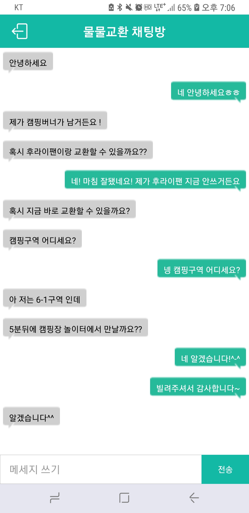

## #EnDorphine

### 2018년 서울시 앱 공모전 출품작(I CAMP U)

#### 기획 배경

1. 시민들이 서울 도심 속에서 편리하게 캠핑장을 이용할 수 있도록 도와주기 위해
2. 서울 캠핑장 예약 진행 시 타 플랫폼으로 이동하여 진행하는 불편함 해소를 위해
3. 캠핑장 예약 독점으로 인한 불법 거래 성행을 줄이기 위해
4. 캠핑장 이용자가 챙기지 못한 물품에 대한 대안의 필요성

#### 주요기능
1. 캠핑장 예약
2. 캠핑장 QR코드로 입장권 대체
3. 캠핑장 이용자들 물물교환 할 수 있는 채팅
4. 캠핑장 이벤트 

#### 화면 구성

- 로그인

  
  
  

- 앱 구성  

  
  
  
  

- 사이드바 

  
  
  
  

- 캠핑장 소개

  
  
  

- 캠핑장 예약 

  
  
  

- 채팅방

  
  

- 이벤트 상세정보

  
  

#### 기대 효과
1. 서울시 캠핑장 예약 및 정보의 통합 플랫폼 제공
2. 물물교환 채팅 기능으로 사용자 편의성 증진
3. 리뷰를 통해 소비자의 캠핑장 정보 습득
